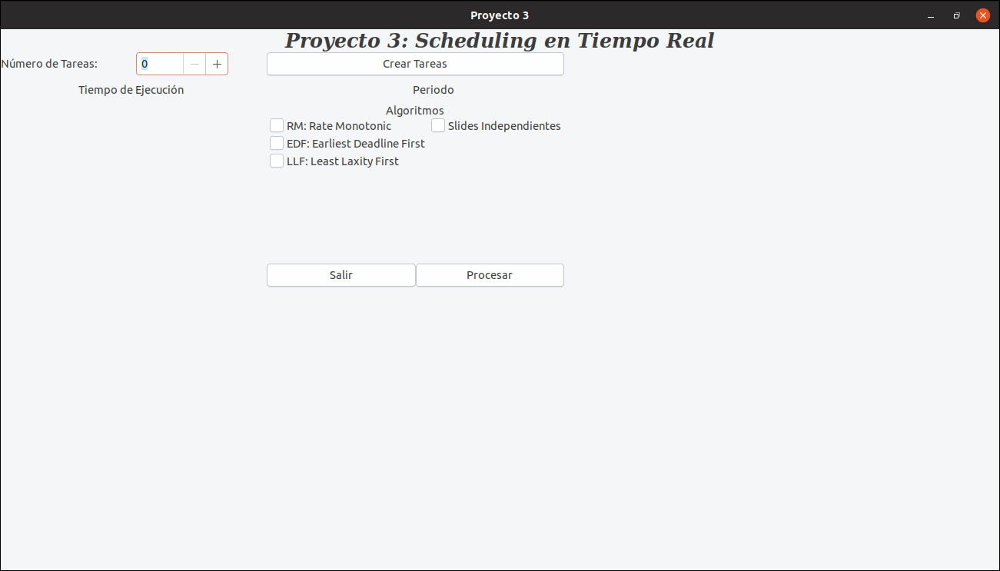

## Proyecto 3 Sistemas Operativos Avanzados
### Scheduling en Tiempo Real

El propósito de este proyecto es simular el comportamiento
de varios algoritmos de scheduling clásicos para Sistemas
Operativos de Tiempo Real (RTOS). 

### II. ALGORITMOS
RTOS:

-RM: Rate Monothonic

-EDF: Earliest Deadline First

-LLF: Least Laxity First

### Instrucciones de uso

#### Compilación
``` bash
$ sudo make install
$ make
```
#### Ejecución
```
$ cd bin/
$ ./main
```
Seleccionar las opciones deseadas en la interfaz gráfica y dar click en procesar:
